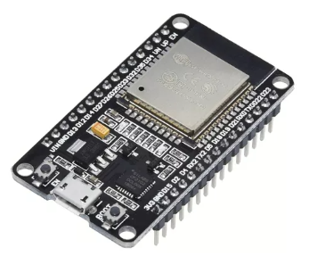

!DOCTYPE html>
<html>
<head>
    <title>Publitec</title>
</head>
<body>
    <h1>Pagina de inicio de Publitec</h1>
    <h2>Pagina de inicio de Publitec</h2>
    
Listo para envio de texto

    

    
Listo para envio de texto a servidor

    <!-- comentarios -->
    
    <form action="respuesta.php" method="get"> 
    <!-- method="post" -->

        <label>Mensaje</label>    
        <input type="text" name="nombre"/>
         
        <input type="submit" />

    </form>

    

</body>
</html>
